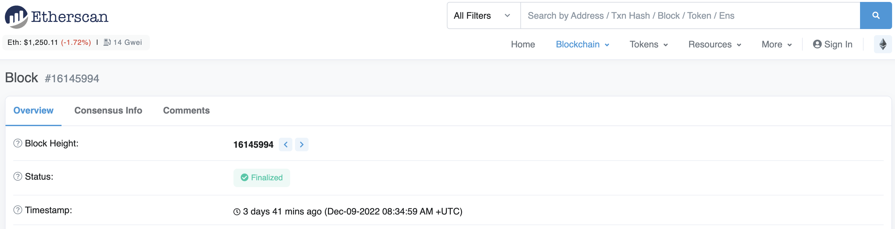

# Basic Sample Hardhat Project

This project demonstrates a basic Hardhat use case. It comes with a sample contract, a test for that contract, a sample script that deploys that contract, and an example of a task implementation, which simply lists the available accounts.

Try running some of the following tasks:

```shell
npx hardhat accounts
npx hardhat compile
npx hardhat clean
npx hardhat test
npx hardhat node
node scripts/sample-script.js
npx hardhat help
```

## 仕様

    ・Xヶ月に一度先着順 n 名における報酬の早押し大会
    ・先着 n 名の値は変更
    ・Xヶ月というのは正確にはできないのでblockNumberでそれに近いものを実現する。
    ・先着の概念を世界中で公平に実施したいので時間帯はできればランダム性があると良い（Roundによって日中の時間帯にできるとうれしい。）

ex
現在の blockNumber が [16,145,994](https://etherscan.io/block/16145994)（2022/12/09） で 3 ヶ月後の blockNumber までを期間とする場合（Ethereum）

→ 1block 12sec 、1 ヶ月を 30 日と仮定する。

→ 1 日 = 24 \* 60 \* 60 = 864,000 秒なので 86400 / 12 = 7,200 ブロック / 日

→ 3 ヶ月 = 7200 \* 90 = 648,000 ブロック

→ 終了&次の先着開始が 16,145,994 + 648,000 = [16,793,994 block](https://etherscan.io/block/countdown/16793994)

→ （検証）前回だと 16,145,994 - 648,000 = [15,497,994](https://etherscan.io/block/15497994) = 2022/09/08 05:50:37 +UTC

block 15497994 （Sep-08-2022 05:50:37 PM +UTC）


block 16145994 （Dec-09-2022 08:34:59 AM +UTC）


block 16793994 （Estimated Target Date: Fri Mar 10 2023 11:23:43 GMT+0900 (日本標準時) / Fri Mar 10 2023 02:23 AM +UTC）


毎回スタートするのではなく、最初から永久的なブロック期間の mapping を持つものとする。

→ 今の blockNumber がどこの先着期間に含まれているか、該当の先着期間でいっぱいになっていないかを確かめれば良さそう。

→ blockNumber 自体がブロックチェーンレベルで正確性が保証されるものだから。

先着が申し込める期間をそれぞれ Round とする。

    イメージ①
    mapping(uint256 => address[]);

    [1] [0xa..., 0xb..., 0xc..., ...]

    [1] [0xd..., 0xe..., 0xf..., ...]


    イメージ② entry時の情報を格納する。
    mapping(uint256 => entries[]);

    [1] [{address: 0xa..., timestamp: 167..., blockNumber: xxxxxxx}, {address: 0xb..., timestamp: 167..., blockNumber: xxxxxxx}]

    [2] [{address: 0xa..., timestamp: 167..., blockNumber: yyyyyyy}, {address: 0xb..., timestamp: 167..., blockNumber: yyyyyyy}]

map の key で持つ 1, 2 というのを blockNumber 上から計算させれば良い。（value にあたるデータは適当です。）

例えば 現 blockNumber が 16,145,994 で（このブロックを constructor 時に genesisBlockNumber とする。)
仮に 1000 ブロック分を 1 先着期間とする。

以下が今後の BlockNumber の範囲に該当する Round

    16145994 ~ 16146993 = 1
    16146994 ~ 16147993 = 2
    16147994 ~ 16148993 = 3
    16148994 ~ 16149993 = 4
    16149994 ~ 16150993 = 5

このときの Round の算出式: (period は先着期間)

    pastBlock = blockNumber - genesisBlockNumber
    Round = ( pastBlock / period ) + 1
    ※最終的に Round は切り捨てられる。

ex:
現 blockNumber が 16,150,993 とする、genesis は 16,145,994

    pastBlock = 16150993 - 16145994 = 4999
    round = ( 4999 / 1000 ) + 1 = 5.999
    ↓ uint なので小数点以下切り捨て
    round = 5

blockNumber に関しては Tx のタイミングで算出。
